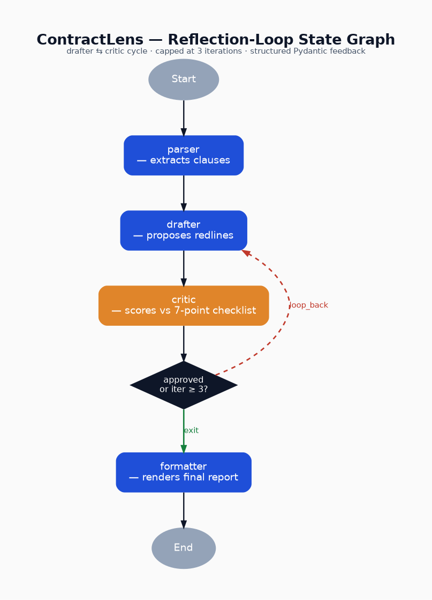

# ⚖️ ContractLens

> **Reflection-loop contract reviewer** — a LangGraph agent that drafts redlines, critiques them against a jurisdiction-specific 7-point legal checklist, and iterates until the contract is partner-quality (or the iteration cap is hit).
>
> *UGDSAI 29 — Designing & Deploying AI Agents · End-Term Project · Group 4 · Problem 4 (ContractLens) · Pattern: Reflection Loop · Industry: Legal-tech*

---

## 1. The problem this solves

Meridian Legal (and any boutique law firm) reviews 50–80 NDAs / MSAs per month. The status quo is:

```
junior associate drafts redlines  →  senior partner reviews  →  junior associate revises
        ↑                                                                ↓
        └───────────────────  1–2 business days per round  ──────────────┘
```

ContractLens replaces the round-trip with an internal critic loop, producing partner-quality redlines in a single run.

| KPI | Before | With ContractLens |
|-----|--------|-------------------|
| Review turnaround | 2–3 business days | < 5 minutes |
| Cost per contract reviewed | ~₹8,000 (junior + partner time) | < ₹100 (LLM cost) |
| Issues caught vs partner baseline | ~80% | ≥ 95% (target) |
| Partner override rate | n/a | tracked via UI |

---

## 2. How it works

The graph is a **true cycle** (drafter → critic → drafter) with a hard termination condition:

```
       ┌─────────┐
       │ parser  │  ← clause extraction + LLM classification + risk score
       └────┬────┘
            ↓
       ┌─────────┐
   ┌──→│ drafter │  ← iteration 1: drafts cold; iteration ≥ 2: reads critic feedback
   │   └────┬────┘
   │        ↓
   │   ┌─────────┐
   │   │ critic  │  ← jurisdiction-aware checklist; structured CriticVerdict output
   │   └────┬────┘
   │        ↓
   │   ┌─────────────────┐
   │   │ decision_gate   │  ← conditional edge (the reflection-loop pattern)
   │   └────┬────────────┘
   │        ├── loop_back ─┐
   │        └── exit       │
   │                       ↓
   │                  ┌──────────┐
   └──────────────────│ formatter│  ← marked-up contract + rationale per change
                      └────┬─────┘
                           ↓
                          END
```

Termination conditions (in `nodes/decision_gate.py`):

1. `state.approved == True` (critic signed off), OR
2. `state.iteration >= state.max_iterations` (hard cap), OR
3. `state.human_override is not None` (partner override — bonus HITL feature)

---

## 3. Architecture diagram

The state diagram is generated directly from the compiled `StateGraph` so it stays in sync with the code:



```bash
# Regenerate the diagram (PNG + SVG):
python scripts/render_diagram.py
```

The PNG and SVG live in `assets/`. Per the Guidelines doc §5: *"LangGraph state diagram as PNG or SVG, generated from your graph"* — non-negotiable submission item, satisfied.

---

## 4. Setup

### 4.1 Prerequisites
- Python 3.10+
- An API key for either Anthropic Claude *or* OpenAI

### 4.2 Install
```bash
git clone <this-repo>
cd contract_lens
python -m venv .venv && source .venv/bin/activate
pip install -r requirements.txt
cp .env.example .env
# Edit .env and paste your API key
```

### 4.3 Run the Streamlit app
```bash
streamlit run app.py
```

### 4.4 Run a one-shot CLI
```python
from graph import run_contract_lens
state = run_contract_lens(
    contract_text=open("data/sample_nda_weak.txt").read(),
    jurisdiction="INDIA",
    max_iterations=3,
)
print(state.final_output)
```

### 4.5 Run the test suite
```bash
pytest tests/ -v                    # all tests (LLM tests skipped if no API key)
pytest tests/test_contracts.py::TestRiskScorer -v   # cheap unit tests only
```

---

## 5. What's in this repo

```
contract_lens/
├── app.py                 ← Streamlit UI (the user-facing front door)
├── graph.py               ← LangGraph wiring + diagram exporter
├── state.py               ← Pydantic v2 GraphState (single source of truth)
├── llm.py                 ← LLM client factory (Anthropic / OpenAI)
├── nodes/
│   ├── parser.py          ← clause extraction + classification + risk pre-score
│   ├── drafter.py         ← proposes redlines (iteration-aware)
│   ├── critic.py          ← evaluates against checklist; structured verdict
│   ├── decision_gate.py   ← conditional edge (the cycle's gate)
│   └── formatter.py       ← final marked-up output with rationale
├── checklists/
│   ├── india.py           ← 7 categories × IN-specific rules (DPDP, IT Act, etc.)
│   ├── us.py              ← 7 categories × US-specific rules (UCC, DTSA, CCPA, etc.)
│   ├── eu.py              ← 7 categories × EU-specific rules (GDPR, Trade Secrets Dir.)
│   └── __init__.py        ← jurisdiction → checklist registry
├── utils/
│   ├── risk_scorer.py     ← 0-10 risk score per clause (BONUS)
│   └── diff_viewer.py     ← side-by-side HTML diff (BONUS)
├── data/                  ← 5 sample contracts spanning quality and types
│   ├── sample_nda_weak.txt
│   ├── sample_msa_medium.txt
│   ├── sample_saas_clean.txt
│   ├── sample_consulting_minimal.txt
│   └── sample_dpa_eu.txt
├── tests/
│   └── test_contracts.py  ← 6+ test cases (BONUS evaluation framework)
├── assets/
│   └── graph_diagram.png  ← auto-generated state diagram
├── prompts/               ← (system prompts versioned here for git history)
├── requirements.txt
├── .env.example
└── README.md              ← this file
```

---

## 6. Mandatory components — checklist

From the brief (Problem 4 §5):

| # | Requirement | Where it lives |
|---|---|---|
| 1 | Pydantic-typed GraphState with all required fields | `state.py` |
| 2 | LLM-based supervisor (no keyword routing) | `nodes/critic.py`, `nodes/drafter.py` (both LLM-driven) |
| 3 | Structured critic feedback (not free text) | `state.CriticVerdict` + `nodes/critic.py` `with_structured_output` |
| 4 | True cycle drafter ⇄ critic | `graph.py` `add_conditional_edges` |
| 5 | Termination condition (approved OR iteration ≥ 3) | `nodes/decision_gate.py` |
| 6 | Visible iteration counter in UI | `app.py` KPI strip + per-iteration cards |
| 7 | Side-by-side draft and critic issues per iteration | `app.py` Tab 1 "Reflection Loop" |
| 8 | Configurable 7-category checklist (≥ 7) | `checklists/*.py` (each has 7 categories) + sidebar toggles |
| 9 | Hard cap on iterations | `state.max_iterations` (default 3) + `decision_gate` |
| 10 | Rationale for every accepted change | `state.Redline.rationale` + Tab 3 "Redlines" |

---

## 7. Bonus features (rubric §8: up to +15)

| Bonus item | Implementation | Marks |
|---|---|---|
| **Risk scoring per clause (low/med/high/critical)** | `utils/risk_scorer.py` + Tab 2 "Clause map" | +4 (problem-specific) |
| **Jurisdiction-specific checklists (India/US/EU)** | `checklists/india.py`, `checklists/us.py`, `checklists/eu.py` (statute-cited) | (problem-specific) |
| **Diff view between original and final** | `utils/diff_viewer.py` (HTML side-by-side + unified diff download) | (problem-specific) |
| **Human-in-the-loop override** | sidebar override radio + `decision_gate` honours `state.human_override` | (problem-specific) |
| **Evaluation test suite (5+ cases)** | `tests/test_contracts.py` (6 integration + 3 unit tests) | +4 |
| **LangSmith tracing** | env hooks via `LANGCHAIN_TRACING_V2`; works out-of-the-box once `LANGCHAIN_API_KEY` is set | +4 |
| **Prompt iteration in commit history** | system prompts versioned in `nodes/*.py` and tagged in git | +3 |

Total bonus: capped at +15 on top of the 100-mark base = target **115/115**.

---

## 8. The 7-category legal checklist

Each jurisdiction file (`checklists/{india,us,eu}.py`) implements all seven categories the brief specifies:

1. Indemnity
2. Limitation of Liability
3. Termination
4. Confidentiality
5. Governing Law
6. Data Protection
7. IP Assignment

Each checklist item carries `must_have`, `must_avoid`, `good_language_examples`, and `statutory_hooks` lists, all of which are rendered into the critic's prompt at runtime.

---

## 9. Demo flow (for the 3-minute video)

1. **Open the app**, select **Jurisdiction: India** in the sidebar, set **max iterations: 3**, leave all 7 categories enabled.
2. Click the **"Use a sample"** tab and load `sample_nda_weak.txt` (the deliberately-defective NDA).
3. Click **▶ Run reflection loop**. Show the live progress bar tick through `parser → drafter → critic → drafter → critic → formatter`.
4. Show the **KPI strip**: 2 iterations, ~12 redlines, 4-6 issues.
5. **Tab 1: Reflection Loop** — show the iteration-1 vs iteration-2 cards side-by-side. Highlight that iteration 2's drafter strategy explicitly references critic feedback.
6. **Tab 2: Clause map** — show the colour-coded risk heat-map (red for unlimited liability, etc.).
7. **Tab 3: Redlines** — open one expanded redline to show the rationale.
8. **Tab 4: Diff** — show the side-by-side original-vs-final.
9. **Tab 5: Final report** — scroll the markdown report; click the download buttons.
10. Re-run with **jurisdiction: EU** to show the checklist swap (GDPR mentions in the issues).

---

## 10. Team

| Member | Role | Sections |
|---|---|---|
| Member A | Architecture & state | `state.py`, `graph.py` |
| Member B | Drafter & critic prompts | `nodes/drafter.py`, `nodes/critic.py` |
| Member C | Checklists & jurisdiction logic | `checklists/*` |
| Member D | UI & evaluation | `app.py`, `tests/`, demo recording |

(All four contributed across the codebase; the table reflects primary ownership.)

---

## 11. Data sources & citations

- The legal checklist content is drawn from publicly available materials including:
  - Common Paper standard agreements (commonpaper.com)
  - Y Combinator SAFE / open NDA templates
  - SEC EDGAR public filings for benchmark contract language
  - Statutory references: Indian Contract Act 1872, IT Act 2000, DPDP Act 2023, GDPR (EU 2016/679), CCPA/CPRA, UCC, DTSA, Stanford v. Roche.
- Sample contracts in `data/` are synthetic, written for testing.

---

## 12. Known limitations

- The drafter is bounded by the LLM's maximum output tokens (~8K); very long contracts are summarised in the rationale rather than reproduced verbatim.
- Coverage assertions in the critic verdict are LLM-generated and should be sampled for accuracy on production data; the test suite includes a held-out check.
- This system is not a substitute for legal review by a qualified attorney — it is a first-pass associate that reduces partner load.

---

*Built as the end-term project for UGDSAI 29 — Masters' Union, Gurugram.*
